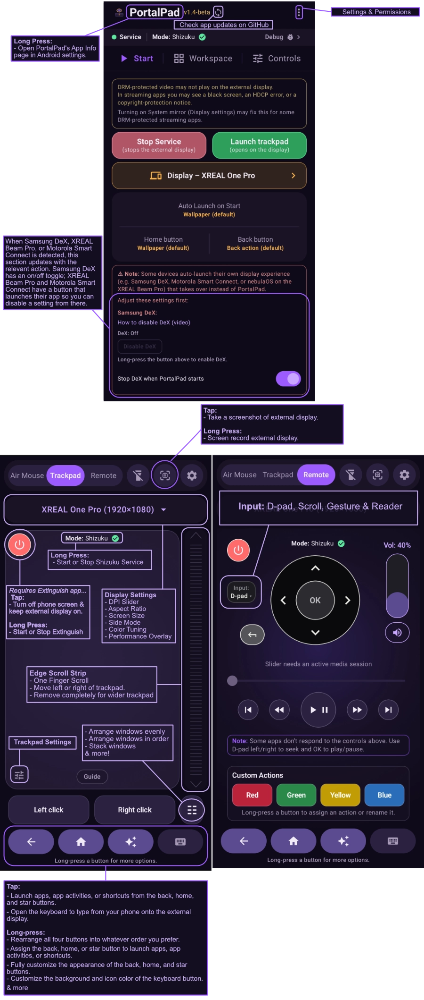
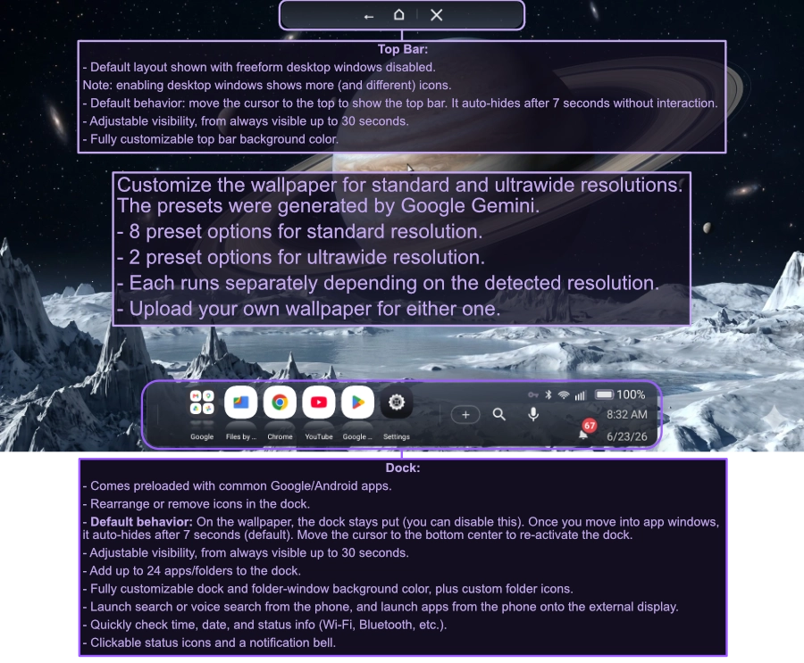
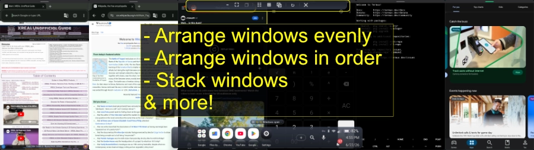

# PortalPad — Trackpad & Remote for External Displays

PortalPad turns your Android phone into a **trackpad, air mouse, and TV-style remote** for any external screen you connect it to — AR glasses (XREAL, VITURE, RayNeo, Rokid, and similar), HDMI monitors, TVs, or projectors.

It's built with Jetpack Compose, and uses Android's Virtual Display plus Shizuku (or root) to inject input and manage the external display.







## Requirements

- **A compatible Android device with USB-C DisplayPort Alt Mode** (Android 11 / API 30 or newer). This is what lets the phone drive an external display. Most AR glasses appear to the phone as a normal USB-C DisplayPort screen. Performance varies by device.
- **Shizuku** (recommended) **or root** — required. PortalPad needs elevated access to inject input into the external display and manage it; Shizuku grants this without rooting. The recommended build is [thedjchi's Shizuku fork](https://github.com/thedjchi/Shizuku), which adds **start-on-boot** (waits for Wi-Fi, then starts the service after a reboot), **TCP mode** (`adb tcpip`, so once it's started over Wi-Fi after a reboot you can stop/restart without a Wi-Fi connection), and a **watchdog** that automatically restarts Shizuku if it stops unexpectedly, and can alert you to crashes and suggest fixes.
- **Extinguish** (recommended) — the power button on the Air Mouse, Trackpad, and Remote screens uses Extinguish to turn the phone's display off while keeping the external display running. It's the only way to blank the phone without dropping the external display, so you'll likely want it. Get it from the [Play Store](https://play.google.com/store/apps/details?id=own.moderpach.extinguish) or [GitHub](https://github.com/Moderpach/Extinguish) (it also requires Shizuku).

## What it does

Connect an external display (or pair AR glasses), and PortalPad gives you three control modes. You switch between them from the top of the screen:

- **Trackpad** — use the phone's surface like a laptop touchpad: move the cursor, tap to click, two-finger scroll, three-finger gestures, and an edge strip for scrolling.
- **Air Mouse** — point and move the cursor by tilting the phone (uses the gyroscope; sensitivity and smoothing are adjustable).
- **Remote** — a D-pad with OK/select, media controls (play/pause, next/previous, rewind/fast-forward), volume up/down with a live level, and four buttons you can program.

You can also connect a **physical Bluetooth or USB mouse** to drive the cursor on the external display directly.

On the external display itself, there's a dock (like the macOS dock) for launching apps, organizing them into folders, and renaming them. A searchable app drawer on the phone lets you add any installed app to that dock.

## Features

**Input and control**

- Three input modes (Trackpad, Air Mouse, Remote) in one app, switchable from the top bar.
- **Physical mouse support** — connect a Bluetooth or USB mouse to move the cursor and click on the external display directly.
- Adjustable input feel: cursor speed, scroll speed, scroll direction, and air-mouse sensitivity, smoothing, and axis inversion.
- A bottom row of Back / Home / App Drawer buttons. Long-pressing Home offers "Recenter cursor."
- Four programmable buttons on the Remote tab. Long-press one to assign an app, activity, or shortcut to launch, or to rename it. Unassigned, a button does nothing when tapped.
- One vibration setting (Off / Light / Medium / Strong) controls haptic feedback everywhere — trackpad, buttons, and the floating controls.

**The external-display dock**

- A macOS-style dock at the bottom of the external screen. Icons magnify as the cursor approaches and pop up above the bar.
- Folders, drag-to-reorder, rename, and a "+" tile that opens the phone's searchable app drawer to add more apps.
- A clock (date and time, following your phone's locale and 12/24-hour setting) and a battery indicator (fills to your charge level, turns red when low, shows a bolt while charging).
- A **status menu** (battery, Bluetooth, and network details) and a **notification panel** — opened from a bell that badges unread counts — so you can glance at and act on notifications from the external display.
- Auto-hides after a few seconds of no interaction (default 7s).

**Window management** (desktop-windows mode)

- A top bar on the external display, plus a **radial menu** you can open from the Trackpad and Air Mouse interfaces (right-click), give you quick window actions:
  * **Arrange evenly** — tile every open window into even columns.
  * **Arrange in order** — tile windows in a chosen order.
  * **Stack** — gather every open window into a neat cascade in one spot.
  * **Maximize / Minimize / Close** — maximize a window to the front, minimize windows one at a time, or close them.
- A window maximized from its title bar (Android's caption bar) joins the layout when you arrange or stack, instead of staying maximized in the background.
- Phone-side lists are available for precision when you'd rather pick from a list than work on the display.
- On the dock itself, an **open-windows bar** and a **minimized-windows bar** appear just above the dock while you're running windows. Tap either to expand a list on the external display — focus or close an open window, or restore a minimized one — without reaching for the phone. The two bars sit side by side when there's room and stack otherwise.
- **Per-resolution window memory** — PortalPad remembers your window layout per display resolution, so switching between standard and ultrawide keeps each layout intact.
- **Session save/restore** — PortalPad can remember your open windows and their positions, then reopen and re-arrange them after a disconnect or restart. It offers this on reconnect, from a top-bar button, or from Settings.

**Customizable external display**

- Set a **wallpaper** for standard and ultrawide resolutions independently (8 presets for standard, 2 for ultrawide, or upload your own for either). The matching wallpaper is shown automatically based on the detected resolution.
- Customize the top-bar and dock background colors, plus custom folder icons.
- The top bar auto-hides after a few seconds (adjustable up to 30s, or always-on); move the cursor to the top to bring it back.

**Typing on the external screen**

- When you tap a text field on the glasses, a **"Type to external display"** page opens on your phone. Whatever you type there is sent to that field — even fields that normally refuse a keyboard, like Chrome's address bar.
- It can **open automatically** when you tap a field. This auto-open needs **PortalPad's accessibility service** turned on (see Permissions). It only opens on a real tap, so a field that an app auto-focuses on launch won't trigger it.
- The typing page opens showing the field's **current text**, so you can edit it — type to append, backspace to delete. Empty fields open blank.

(See Known limitations for the one case this can't handle: typing continuously into in-page web search boxes like google.com's.)

**Other**

- **Cleaner external display** — PortalPad shows the external screen through its own virtual-display layer. The practical payoff: dropdowns (like Chrome's address-bar suggestions) and on-screen menus keep working correctly on the external screen as you move the cursor, instead of glitching or jumping back to the phone.
- **Screen-off control (Extinguish)** — the power button on the Air Mouse, Trackpad, and Remote screens turns the phone's screen off while keeping the external display running (works with the Extinguish app).
- **Screenshot and screen recording** — tap the capture button to screenshot the external display, or long-press to screen-record it.
- **Smooth connect/disconnect** — a brief cover hides the attach/detach so it looks like a clean transition instead of a flash.

## How input works (Shizuku or root)

Android doesn't normally let an app inject input into another display, so PortalPad needs elevated access. It supports two ways to get it:

- **Shizuku** (recommended) — a companion app that grants the needed access without rooting your phone. You authorize it once.
- **Root** — fully supported as an alternative, with the same capabilities as the Shizuku path, and it keeps working after a reboot without re-running a command.

Either way, the actual input injection and display setup go through this elevated access. The accessibility service (below) is separate — it's only used to *detect* when you tap a field, so the typing relay can open by itself.

## Project layout

```
app/src/main/java/com/portalpad/app/
├── MainActivity.kt              -- settings host
├── TrackpadActivity.kt          -- the full-screen Trackpad / Air Mouse / Remote UI
├── KeyboardRelayActivity.kt     -- the phone-side typing relay
├── ui/
│   ├── trackpad/                -- trackpad surface, top bar, app drawer, scroll bar, radial menu
│   ├── mediacontrols/           -- Remote tab: D-pad, media controls, volume, color buttons
│   ├── dock/                    -- external-display dock, edit menus, rename, folders
│   ├── settings/                -- settings tabs (Start/Setup, Display, Controls, Permissions, System)
│   ├── power/                   -- screen-off (Extinguish) power button
│   ├── common/                  -- shared UI pieces
│   └── theme/                   -- Material 3 theme + brand colors (amber + violet)
├── service/                     -- foreground service, input injector, Shizuku backend,
│                                   floating controls, air-mouse + physical-mouse controllers
├── presentation/                -- overlays drawn on the external display (cursor, dock, nav,
│                                   window arranger)
├── shizuku/                     -- Shizuku connection + service binding
├── data/                        -- saved preferences, dock model, backup/restore
├── diag/                        -- in-app log viewer for troubleshooting
└── cpp/                         -- native helper for low-level mouse input
```

## Building

The easiest way is **Android Studio**:

1. Install Android Studio (any recent version; the project targets compileSdk 35).
2. **File → Open** and select the project folder. Let it finish syncing.
3. Press ▶ to build, install, and launch on a connected phone.

From the command line instead — the Gradle wrapper is included, so you don't need a separate Gradle install:

```
./gradlew assembleDebug        # macOS / Linux
gradlew.bat assembleDebug      # Windows (cmd) — or .\gradlew assembleDebug in PowerShell
```

The APK is at `app/build/outputs/apk/debug/app-debug.apk`.

## Permissions

Most of these are optional and only asked for when you use the related feature.

- `SYSTEM_ALERT_WINDOW` — draws PortalPad's overlays (the cursor, dock, top bar, and the floating controls) on the external display.
- `FOREGROUND_SERVICE` / `FOREGROUND_SERVICE_SPECIAL_USE` — keeps the control service running while you're using an external display.
- `POST_NOTIFICATIONS` — the foreground-service notification and alerts.
- `REQUEST_IGNORE_BATTERY_OPTIMIZATIONS` — optional; lets the service keep running in the background so it can notice display connects and keep working with the screen off.
- `QUERY_ALL_PACKAGES` — lists your installed apps for the dock and app drawer.
- `RECORD_AUDIO` — optional; voice search from the dock.
- `CAMERA` — optional; toggles the phone's flashlight from the remote. (Android routes the flashlight through the camera permission; no photos are taken.)
- `READ_PHONE_STATE` — optional; shows your mobile network type (5G/LTE) in the status area.
- `BLUETOOTH` / `BLUETOOTH_CONNECT` — optional; counts connected Bluetooth devices for the status menu, and supports a connected Bluetooth mouse.
- `RECEIVE_BOOT_COMPLETED` — optional; auto-starts the service after a reboot.
- `ACCESS_NETWORK_STATE` — reads connectivity for the Wi-Fi/mobile status icons.
- `WAKE_LOCK` — keeps the connection alive while driving the external display.
- `VIBRATE` — haptic feedback on taps and buttons.
- `BIND_ACCESSIBILITY_SERVICE` — optional; powers the auto-open typing page (detecting when you tap a field on the glasses). Without it, auto-open is off, but everything else still works.
- Granted through Shizuku/root at runtime: `INJECT_EVENTS` (input injection), `INTERNAL_SYSTEM_WINDOW` (overlays above the system UI), `MANAGE_ACTIVITY_TASKS` (window management), and `WRITE_SECURE_SETTINGS` (protected settings for input and display setup).

## Known limitations

- **DRM-protected streaming** (Netflix HD, Hulu, etc.) won't play on the external display. These services require HDCP-protected output, which PortalPad's virtual-display layer can't provide. Workaround: use your phone's normal screen-mirroring for DRM video.
- **Switching resolutions relaunches fullscreen windows** — when the display re-enumerates on a resolution/aspect change, windows running fullscreen are closed and relaunched into place, which can lose in-app state (for example, the current page in a browser tab).

## License

Released under the MIT License — you're free to use, modify, fork, and redistribute it (including commercially), as long as the copyright notice and license text are kept. See [LICENSE](LICENSE) for the full text.
